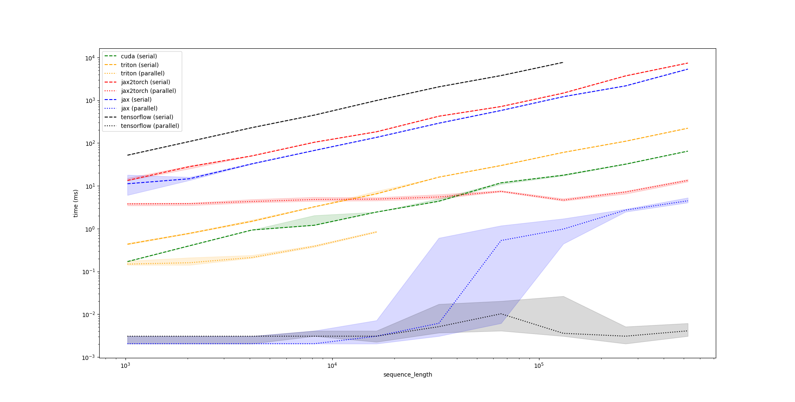
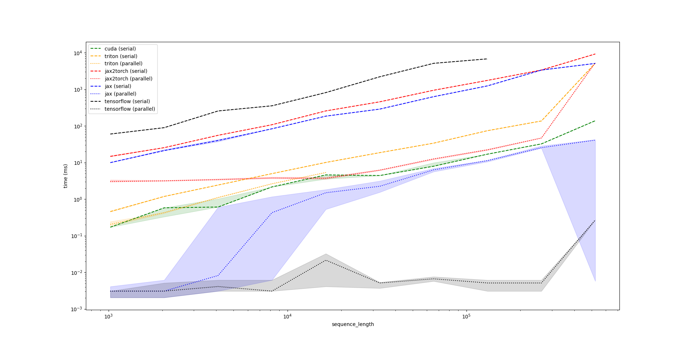
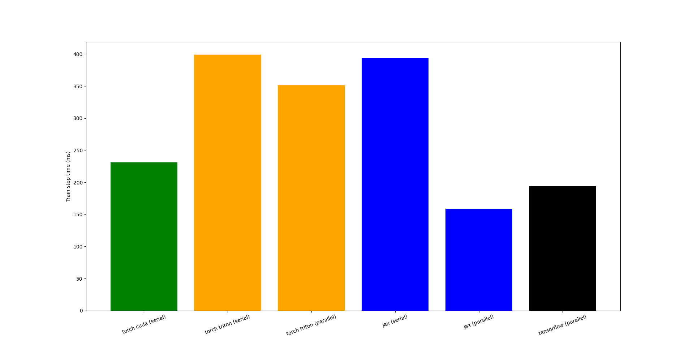

# WKV Implementation Performance

A few disclaimers to start with:

- I'm not a torch guy. There are probably a lot of optimizations I could do to make things run faster there. I'm sure there are improvements that could be made to these implementations. I'm not trying to make a statement in the `jax` vs `torch` debate.
- All the triton I know I've learned from doing this project. I'm still not sure _how_ triton's `associative_scan` takes advantage of multiple cores because it's launched from within the kernel...
- All results below were from runs on a laptop GPU. This is obviously worlds away from realistic training/inference environments, but is the best I can do on the hardware I have available.

Results should serve as a proof of concept and starting point for further investigation rather than be indicative of typical performance.

## Microbenchmarks

[benchmark/wkv.py](./benchmark/wkv.py) has a simple benchmark based on `triton.testing.Benchmark` that shows the time for a single forward pass of a single `WKV` operation against sequence length for various implementations. Below are two plots using 32 and 256 embedding dimensions.

```bash
python benchmark/wkv.py --triton_parallel_threshold 16384 -d 32
```



```bash
python benchmark/wkv.py --triton_parallel_threshold 16384 -d 256
```



If you're wondering what happens to `triton-parallel` after `2**14=16_384`, so am I! The benchmark script seems to hang for any values higher than that...

In each case, the parallel implementations scale better for longer sequences up to a point. This point comes earlier for larger embeddings, presumably as the cores become saturated from parallelism over the embedding dimension. We offer no explanation for why the parallel tensorflow implementation scales so much better than jax's.

## Training Benchmarks

To get an idea of performance during full model training, we consider training times for the 12-layer 768 hidden dimension `rwkv-4-pile-169m` preset using the training script provided in [examples/train.py](./examples/train.py). It is very hacky and very dirty. Before we get to the results, a few additional disclaimers:

- keras does a lot of optimizations, but I'm willing to bet the tensorflow/jax backends have been prioritized for jit compilation support. Maybe I'm wrong.
- the torch cuda implementation does not have gradient support. It's unclear how much of an impact that plays.
- the `--smoke` flag makes these tests run very fast - 2 epochs with 50 steps each using the default batch size of 2. We look at the run time from the second epoch. As discussed above, this is obviously a tiny setup, and it is questionable how applicable these results would be to any real-world training environment.

With that out of the way, results from tiny training runs are below (see [benchmark/plot-train-times.py](./benchmark/plot-train-times.py) for instructions on generating the data). Note we do not plot the tensorflow serial implementation time (~2000ms) because it distorts the axis such that it makes other insights more difficult to glean.



I make the following observations:

- apart from the CUDA implementation, the parallel implementations are faster than the serial implementations;
- the serial implementations introduced here are all slower than the `rwkv` provided CUDA implementation (though again, the CUDA implementation does not include a backwards pass);
- the fastest parallel implementation is jax, which is  ~31% faster than `rwkv`'s CUDA torch implementation.

## Further Work

A parallel CUDA implementation is clearly missing here. Implementation would not be particularly difficult - just a wrapper around thrust's [inclusive_scan](https://thrust.github.io/doc/group__prefixsums.html) or [inclusive_scan_by_key](https://thrust.github.io/doc/group__segmentedprefixsums.html). jax implementations may benefit, though switching away from `jax.lax.associative_scan` may result in less beneficial XLA optimizations. Note the gradients of the `cumsum` implementations can be implemented in terms of `cumsum`, so additional custom gradient code is unneccessary.

Results on a more realistic training/inference environment would also be more informative.
